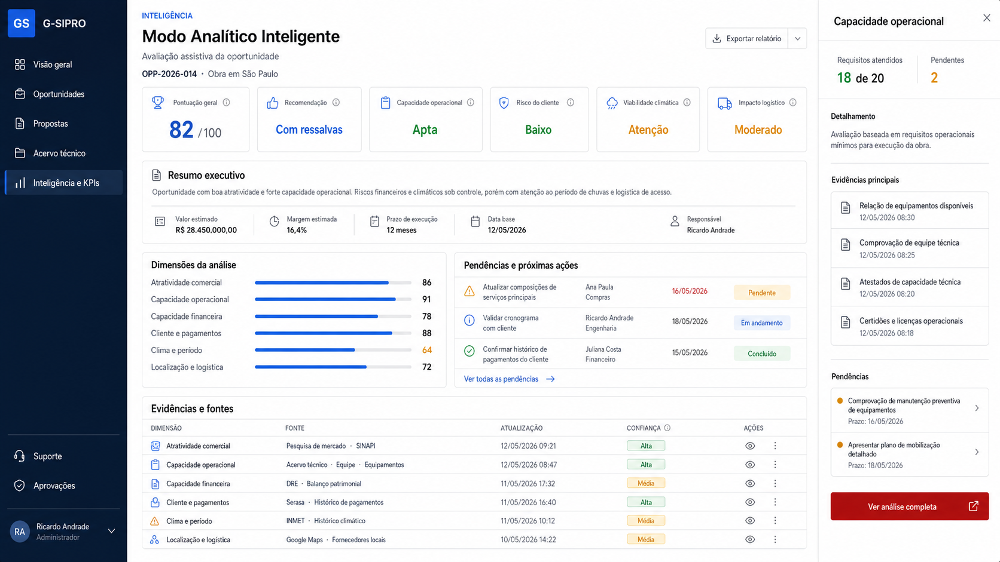
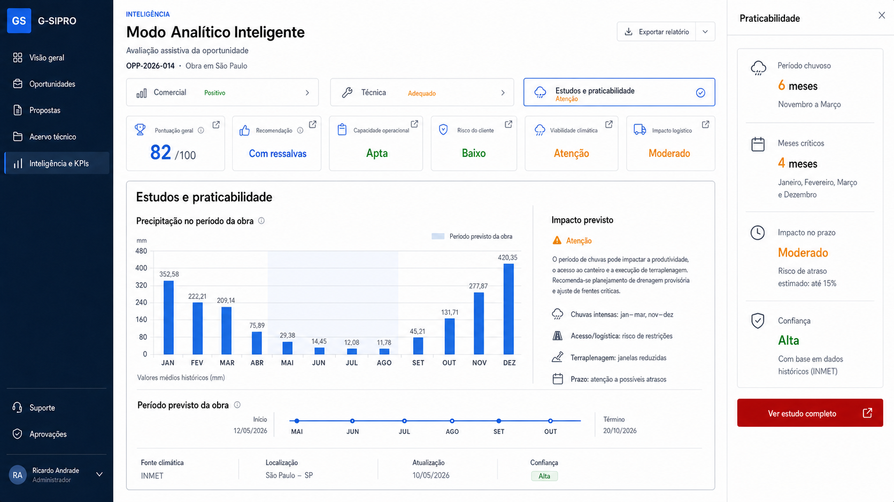
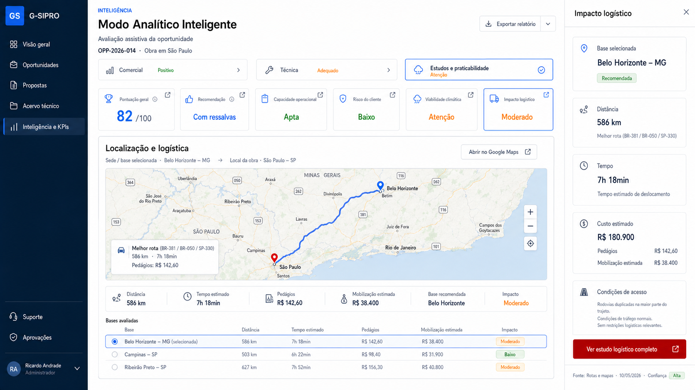

# GSIPRO-ESP-001 — Modo Analítico Inteligente

- Revisão: REV00
- Situação: aprovada pelo proprietário
- Aprovação: 24/07/2026
- Módulo: Inteligência e KPIs
- Aplicação: oportunidades e propostas
- Implementação: T0 a T6 concluídos estruturalmente no ambiente local; credenciais externas, interface visual e homologação pendentes

## 1. Objetivo

Criar um painel analítico inteligente para apoiar a decisão de participar ou não de uma oportunidade. O recurso deve reunir análises comerciais, operacionais, financeiras, climáticas, logísticas e de risco do cliente, confrontando dados externos autorizados e dados internos rastreáveis do G-SIPRO.

O resultado é assistivo. A decisão empresarial permanece humana e sujeita às regras de aprovação definidas neste documento.

## 2. Resultado esperado

Para cada oportunidade, o sistema deve apresentar:

- pontuação geral de 0 a 100;
- recomendação `RECOMENDADO`, `RECOMENDADO_COM_RESSALVAS` ou `NAO_RECOMENDADO`;
- resumo executivo dos fatores favoráveis e desfavoráveis;
- riscos, impedimentos críticos e informações pendentes;
- capacidade operacional da empresa perante as exigências identificadas;
- análise do histórico e do risco de pagamento do cliente;
- análise climática e logística da região;
- fontes, datas, evidências e versão do cálculo;
- indicação das próximas ações e dos responsáveis.

## 3. Momento da análise

### 3.1 Análise preliminar

A primeira análise é iniciada no cadastro da oportunidade, utilizando somente as informações disponíveis naquele momento.

Na ausência de edital ou documentação técnica:

- a análise deve ser identificada como preliminar;
- nenhuma informação ausente pode ser inventada;
- fatores sem dados suficientes devem ser classificados como `PENDENTE`;
- o grau de confiança deve ser informado.

### 3.2 Enriquecimento progressivo

A análise deve ser recalculada quando forem adicionados ou alterados:

- edital;
- termo de referência;
- estudo técnico preliminar;
- planilhas e anexos;
- dados do cliente;
- informações financeiras autorizadas;
- dados operacionais internos;
- localização ou base operacional;
- fontes climáticas ou logísticas.

Cada recálculo cria uma nova versão. A versão anterior permanece preservada, com registro do que mudou, quando mudou e qual fonte provocou a atualização.

## 4. Dimensões analíticas

As dimensões devem ser organizadas em três perspectivas de decisão:

- **Comercial:** preço, atratividade, oportunidade, cliente e condições de pagamento;
- **Técnica:** capacidade operacional, qualificações, acervos, equipe, equipamentos e atendimento aos requisitos;
- **Estudos e praticabilidade:** clima, período chuvoso, localização, distância, rota, acessibilidade, mobilização e logística.

O painel mantém uma conclusão consolidada, mas o usuário deve poder abrir cada perspectiva e aprofundar suas informações sem sair da oportunidade.

### 4.1 Atratividade comercial e valores

Deve considerar, quando disponíveis:

- valor estimado da contratação;
- custos previstos;
- margem estimada;
- contratos e propostas semelhantes;
- descontos históricos;
- necessidade de garantias;
- exposição financeira;
- compatibilidade entre valor, prazo e escopo.

Não devem ser presumidos custos, margens, pesos ou limites sem definição aprovada.

### 4.2 Período e prazo

Deve avaliar:

- prazo restante para preparar a proposta;
- prazo de mobilização;
- período de execução;
- datas críticas;
- riscos de atraso;
- reajustes previstos;
- compatibilidade entre escopo, prazo e capacidade disponível;
- duração de contratos semelhantes.

### 4.3 Viabilidade climática

Deve considerar:

- período chuvoso da região;
- precipitação histórica;
- temperatura;
- eventos climáticos extremos;
- acessibilidade da obra;
- possíveis impactos na produtividade;
- possíveis impactos na mobilização e no cronograma.

A fonte climática, a data de consulta, a localização analisada e o período de referência devem ser apresentados.

### 4.4 Capacidade operacional

O nome oficial desta dimensão é **Capacidade operacional**.

Ela deve confrontar as exigências do edital e dos demais documentos com os dados autorizados da empresa, incluindo:

- acervo técnico;
- serviços executados;
- quantitativos mínimos;
- qualificações técnicas;
- profissionais e registros;
- equipe disponível;
- equipamentos;
- fornecedores;
- obras e compromissos em andamento;
- capacidade de mobilização;
- condições operacionais e financeiras exigidas.

O resultado deve informar:

- se a empresa está apta a participar;
- requisitos atendidos;
- requisitos parcialmente atendidos;
- requisitos não atendidos;
- informações pendentes de confirmação;
- acervos, profissionais e dados utilizados;
- motivos e evidências da conclusão;
- ações necessárias para eliminar pendências.

Uma ausência de informação não equivale automaticamente a requisito não atendido.

### 4.5 Capacidade financeira

A análise financeira deve verificar os índices e condições expressamente exigidos pelo edital, confrontando-os com dados internos autorizados.

Devem ser observados:

- fórmula e limite exigidos;
- período contábil de referência;
- fonte interna utilizada;
- resultado calculado;
- situação de atendimento;
- eventual alto risco de endividamento.

Dados financeiros devem possuir acesso restrito e trilha de auditoria.

### 4.6 Desempenho de pagamento do cliente

Deve combinar:

- registros internos do G-SIPRO;
- histórico financeiro interno autorizado;
- atrasos médios;
- valores vencidos e não pagos;
- renegociações;
- disputas;
- recorrência de atrasos;
- fontes públicas ou externas autorizadas.

Informações externas negativas somente podem influenciar a análise quando possuírem:

- fonte identificável;
- data de obtenção;
- evidência preservada;
- possibilidade de revisão humana.

O resultado deve apresentar classificação, pontuação, justificativa e origem das informações.

### 4.7 Localização e logística

A inteligência deve identificar automaticamente a base operacional mais adequada e calcular:

- distância;
- tempo estimado de deslocamento;
- rota;
- pedágios;
- hospedagem;
- mobilização;
- custos logísticos;
- condições de acesso.

A base escolhida e os critérios da escolha devem ser explicados.

## 5. Impedimentos críticos

São impedimentos críticos inicialmente aprovados:

- alto risco de endividamento;
- cliente classificado como não pagador.

Um impedimento crítico não encerra a oportunidade automaticamente. Ele deve:

1. classificar a oportunidade como dependente de decisão;
2. gerar solicitação obrigatória ao proprietário;
3. apresentar evidências, riscos e orientação;
4. impedir a confirmação da participação até a decisão.

Somente o proprietário pode contrariar uma recomendação `NAO_RECOMENDADO`. A decisão exige justificativa e auditoria.

## 6. Pontuação e recomendação

### 6.1 Pontuação

A pontuação geral utiliza escala de 0 a 100.

Os pesos das dimensões devem:

1. ser sugeridos pela IA;
2. ser apresentados com justificativa;
3. ser aprovados pelo proprietário antes de vigorar;
4. possuir versão e data de vigência;
5. nunca ser modificados silenciosamente.

### 6.2 Recomendação

O resultado deve utilizar:

- `RECOMENDADO`;
- `RECOMENDADO_COM_RESSALVAS`;
- `NAO_RECOMENDADO`.

A recomendação deve sempre conter:

- resumo executivo;
- fatores determinantes;
- riscos;
- ressalvas;
- pendências;
- grau de confiança;
- fontes utilizadas;
- data e versão.

## 7. Pendências e confirmação

Quando faltar informação, o sistema deve:

1. registrar o item como `PENDENTE`;
2. explicar por que a informação é necessária;
3. indicar quem pode fornecê-la;
4. solicitar a informação;
5. recalcular automaticamente após o preenchimento;
6. preservar a versão anterior.

O usuário mestre pode confirmar ou corrigir dados utilizados na análise. Correções financeiras ou informações com acesso restrito permanecem sujeitas às permissões específicas do dado de origem.

## 8. Fluxo funcional

1. Usuário cadastra a oportunidade.
2. IA produz análise preliminar.
3. Sistema apresenta pontuação, recomendação, riscos e pendências.
4. Novos documentos ou informações são incluídos.
5. IA confronta requisitos com dados internos e fontes autorizadas.
6. Sistema cria nova versão e destaca as mudanças.
7. Usuário mestre confirma ou corrige pendências autorizadas.
8. Se houver impedimento crítico, o proprietário recebe solicitação de decisão.
9. O proprietário aprova, rejeita ou contraria a recomendação com justificativa.
10. A decisão final permanece vinculada à oportunidade e segue para a proposta, quando aplicável.

## 9. Especificação visual

Protótipo visual REV00 para avaliação do proprietário:

Protótipos de interação REV01:

### 9.1 Localização

O recurso deve integrar o módulo **Inteligência e KPIs**, com acesso contextual a partir de cada oportunidade.

Na relação de oportunidades, a ação de visualizar deve abrir o registro e permitir acessar a análise inteligente.

### 9.2 Perspectivas da decisão

Logo abaixo da identificação da oportunidade, apresentar três seletores compactos:

- **Comercial**;
- **Técnica**;
- **Estudos e praticabilidade**.

Cada seletor deve:

- apresentar ícone, nome e situação resumida;
- funcionar como acesso ao detalhamento;
- indicar visualmente quando estiver selecionado;
- preservar a pontuação consolidada no topo;
- permitir alternância sem recarregar ou perder o contexto da oportunidade.

### 9.3 Cabeçalho

O cabeçalho do painel deve apresentar:

- identificação da oportunidade;
- cliente;
- localização;
- data da última análise;
- condição `PRELIMINAR` ou `ATUALIZADA`;
- botão de recalcular, quando autorizado;
- ação de consultar versões.

### 9.4 Cards principais

O painel deve utilizar cards sóbrios e com cores suaves para:

- pontuação geral;
- recomendação;
- capacidade operacional;
- risco do cliente;
- viabilidade climática;
- impacto logístico.

Os cards são resumos e não substituem as evidências.

Cada card analítico deve possuir um pequeno ícone de detalhamento no canto superior direito. Ao acioná-lo, o sistema abre a análise correspondente no painel principal e apresenta um resumo complementar no painel lateral.

### 9.5 Corpo do painel

Após os cards, exibir:

1. resumo executivo;
2. fatores favoráveis;
3. riscos e impedimentos;
4. pendências e próximas ações;
5. dimensões analíticas;
6. fontes e evidências;
7. histórico de versões e decisões.

Cada dimensão deve permitir expansão para mostrar cálculo, justificativa, fonte e data.

### 9.6 Detalhamento de estudos e praticabilidade

Ao selecionar **Estudos e praticabilidade** ou abrir o card de viabilidade climática, apresentar:

- gráfico de precipitação mensal;
- destaque visual do período previsto da obra;
- identificação dos meses chuvosos e dos meses críticos;
- impacto estimado na produtividade;
- impacto no acesso, mobilização, terraplenagem e cronograma;
- linha do tempo da execução;
- fonte climática;
- localização analisada;
- data de atualização;
- grau de confiança;
- acesso ao estudo completo.

O gráfico deve permitir relacionar precipitação e período real da obra, sem apresentar uma média anual isolada como conclusão suficiente.

### 9.7 Detalhamento de localização e logística

Ao abrir o card de impacto logístico, apresentar um card amplo com:

- mapa de rota;
- sede ou base operacional de origem;
- localização da obra;
- distância;
- tempo estimado;
- pedágios;
- custo estimado de mobilização;
- condições de acesso;
- impacto logístico;
- bases alternativas avaliadas;
- justificativa da base recomendada;
- ação **Abrir no Google Maps**;
- fonte, atualização e confiança.

O mapa deve ocupar a maior área do detalhamento. A rota deve ser visualmente clara, moderna e útil para decisão, sem reduzir a análise a uma simples imagem decorativa.

A integração futura com Google Maps depende de aprovação técnica, comercial, de segurança e de tratamento de dados.

### 9.8 Tabelas

As tabelas devem seguir `GSIPRO-PADRAO-VISUAL-TABELAS`:

- painel branco único;
- título e controles na mesma barra;
- busca, filtros e ação principal na ordem aprovada;
- linhas compactas;
- status com cores suaves;
- ações por ícones acessíveis;
- paginação com 10, 25, 50 e 100 linhas.

### 9.9 Painel lateral

Ao selecionar uma dimensão, pendência, evidência ou versão, abrir painel lateral direito com:

- detalhe;
- resultado;
- justificativa da IA;
- fontes;
- dados confrontados;
- histórico;
- responsável;
- ações autorizadas.

Para praticabilidade, o painel lateral deve resumir período chuvoso, meses críticos, impacto no prazo e confiança.

Para logística, o painel lateral deve resumir base selecionada, distância, tempo, custo, condições de acesso e ação para abrir o estudo completo.

### 9.10 Identidade visual

Aplicar o padrão sóbrio aprovado para o G-SIPRO:

- fundo claro;
- baixa densidade cromática;
- vermelho institucional somente para ações e destaques necessários;
- cores de status em tons suaves;
- tipografia e espaçamento consistentes com Propostas e Oportunidades;
- ausência de alegorias, gradientes densos e blocos redundantes.

## 10. Comunicações

Eventos relevantes devem ser apresentados:

- no painel do G-SIPRO;
- no Microsoft Teams;
- por e-mail.

Devem gerar comunicação:

- conclusão de nova análise;
- mudança relevante da recomendação;
- impedimento crítico;
- solicitação de informação;
- solicitação de decisão do proprietário;
- decisão registrada.

A mensagem deve conter link para o registro, resumo, responsável e próxima ação, sem expor dados restritos no corpo da notificação.

## 11. Perfis e permissões

Permissões propostas para futura aprovação:

- `analytics.read`: consultar análises autorizadas;
- `analytics.calculate`: solicitar novo cálculo;
- `analytics.confirm`: confirmar dados e pendências;
- `analytics.configure`: propor pesos e parâmetros;
- `analytics.approve-config`: aprovar pesos e parâmetros;
- `analytics.decide`: registrar decisão empresarial;
- `analytics.override`: contrariar recomendação não favorável;
- `analytics.read-financial`: consultar dados financeiros restritos;
- `analytics.read-client-risk`: consultar detalhes do risco do cliente.

Regras mínimas:

- usuário mestre pode confirmar ou corrigir dados conforme suas permissões;
- somente o proprietário aprova pesos;
- somente o proprietário pode superar `NAO_RECOMENDADO`;
- decisões, correções e acessos a dados restritos são auditados;
- a negação de acesso não deve revelar conteúdo protegido.

## 12. Rastreabilidade e governança da IA

Cada análise deve registrar:

- oportunidade;
- versão;
- modelo e configuração utilizados;
- pesos vigentes;
- fontes internas;
- fontes externas;
- data e hora;
- ator ou processo solicitante;
- resultados por dimensão;
- pontuação;
- recomendação;
- grau de confiança;
- pendências;
- impedimentos;
- decisão humana;
- correlação de auditoria.

Regras:

- a IA não inventa dados;
- a IA diferencia fato, cálculo, inferência e recomendação;
- toda conclusão material deve apontar sua fonte;
- resultados anteriores são imutáveis;
- alteração de fonte gera nova versão;
- a decisão humana não apaga a recomendação original;
- dados financeiros e pessoais permanecem sob menor privilégio.

## 13. Arquitetura proposta

O recurso deve permanecer no monólito modular do G-SIPRO, conforme ADR-0001.

Domínios previstos:

- análise da oportunidade;
- capacidade operacional;
- risco do cliente;
- clima e logística;
- configuração de pesos;
- decisão e aprovação;
- notificações;
- auditoria e versionamento.

Integrações externas devem ser encapsuladas por adaptadores, possuir timeout, tratamento de indisponibilidade, identificação da fonte e política de atualização. Falha de uma fonte externa não pode ser convertida silenciosamente em nota negativa.

## 14. Fora do escopo desta revisão

Esta especificação não autoriza:

- programação;
- criação de tabelas ou migrações;
- contratação de provedores de dados;
- integração com serviços climáticos, mapas ou bureaus financeiros;
- definição definitiva das fórmulas e pesos;
- uso de dados financeiros sem aprovação de acesso;
- publicação do recurso.

## 15. Critérios de aceite da futura implementação

O recurso será considerado funcionalmente apto quando:

- produzir análise preliminar a partir da oportunidade;
- recalcular e versionar após novas informações;
- demonstrar todas as dimensões aprovadas;
- confrontar requisitos e dados internos sem inventar informações;
- apresentar pontuação, recomendação, confiança, fontes e pendências;
- encaminhar impedimentos críticos ao proprietário;
- impedir superação de `NAO_RECOMENDADO` por perfil não autorizado;
- registrar decisão, justificativa e auditoria;
- enviar notificações por painel, Teams e e-mail;
- cumprir o padrão visual aprovado;
- passar por testes funcionais, segurança, acessibilidade, auditoria e homologação do proprietário.

## 16. Decisões pendentes para a etapa técnica

Antes da implementação, devem ser aprovados:

- fontes climáticas;
- provedor de mapas, rotas e distância;
- fontes externas de risco do cliente;
- origem dos dados financeiros internos;
- fórmula de pontuação;
- pesos iniciais;
- limites de cada classificação;
- periodicidade de atualização;
- política de retenção;
- destinatários de Teams e e-mail;
- protótipo visual.
