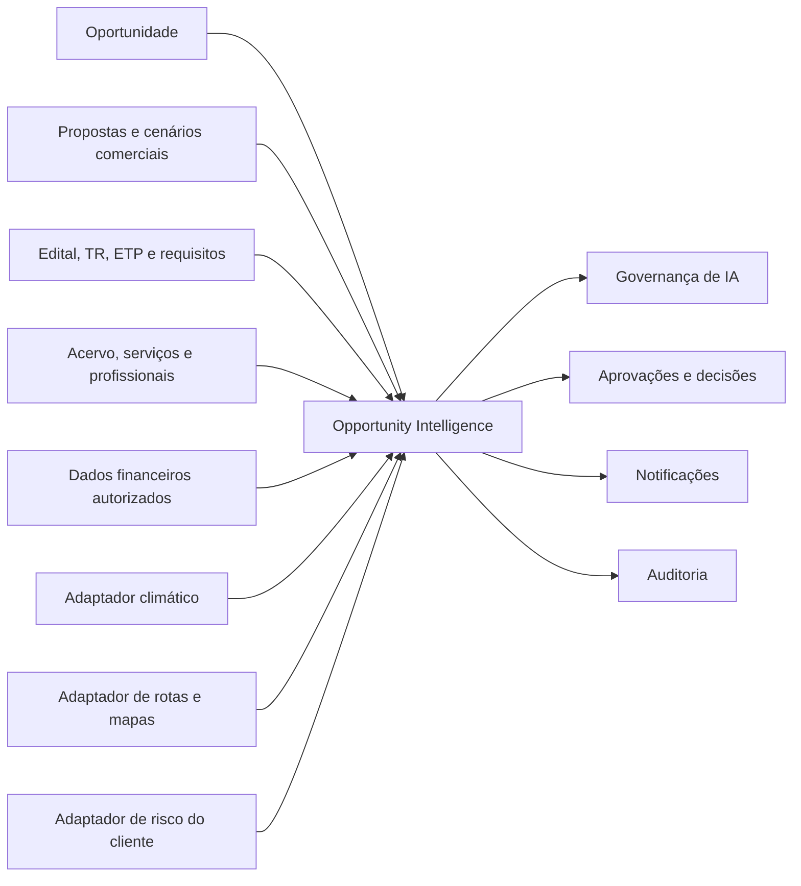

# GSIPRO-TEC-206 — Especificação Técnica do Modo Analítico Inteligente

- Revisão: REV00
- Situação: aprovada pelo proprietário
- Aprovação: 24/07/2026
- Origem funcional: GSIPRO-ESP-001 REV00
- Arquitetura: monólito modular, conforme ADR-0001
- Stack: Node.js 24, TypeScript, Next.js 16, React 19, PostgreSQL, Prisma ORM 7, Zod, Pino e Vitest
- Implementação: T0 a T6 concluídos estruturalmente no ambiente local; credenciais dos provedores climático, Google Routes e canais Microsoft Graph pendentes

## 1. Finalidade técnica

Definir a estrutura necessária para produzir análises versionadas, explicáveis e rastreáveis de oportunidades, organizadas nas perspectivas:

- Comercial;
- Técnica;
- Estudos e praticabilidade.

O módulo deve consolidar dados internos do G-SIPRO e fontes externas autorizadas, calcular resultados reproduzíveis e encaminhar decisões críticas ao proprietário sem substituir a decisão empresarial.

## 2. Princípios obrigatórios

- nenhuma informação ausente pode ser inventada;
- fato, cálculo, inferência e recomendação devem ser diferenciados;
- toda conclusão material deve possuir fonte;
- toda execução gera versão imutável;
- mudança de dado ou documento gera nova execução;
- pesos e limites somente vigoram após aprovação do proprietário;
- falha de integração não pode ser convertida em nota negativa;
- impedimento crítico exige decisão do proprietário;
- decisão humana não apaga o resultado original;
- dados financeiros e de risco do cliente operam sob menor privilégio;
- todas as ações críticas possuem correlação e auditoria.

## 3. Contexto arquitetural

O recurso será incorporado como módulo de domínio `opportunity-intelligence`, sem criação de microserviço neste estágio.

Dependências internas:

- `opportunities`;
- `proposals`;
- `tenders`;
- `documents`;
- `technical-collection`;
- `compliance-matrix`;
- `commercial-proposals`;
- `analytics`;
- `ai-governance`;
- `workflow`;
- `identity`;
- `audit`.



## 4. Limites do módulo

O módulo é responsável por:

- orquestrar a coleta das fontes;
- gerar um conjunto de entrada canônico;
- calcular dimensões determinísticas;
- solicitar análise assistiva à IA aprovada;
- registrar resultados e evidências;
- calcular pontuação consolidada;
- detectar impedimentos críticos;
- criar pendências;
- solicitar decisão;
- publicar notificações.

O módulo não é responsável por:

- alterar o acervo técnico;
- corrigir dados financeiros;
- modificar edital ou proposta;
- contratar ou autorizar fontes externas;
- decidir pela empresa;
- ocultar divergências;
- substituir validação técnica, contábil ou comercial.

## 5. Modelo conceitual de dados

Os nomes abaixo são conceituais. A criação física dependerá da aprovação desta especificação.

### 5.1 `IntelligencePolicy`

Definição versionada da política analítica:

- chave estável;
- versão;
- vigência;
- dimensões;
- pesos;
- limites de classificação;
- regras de impedimento;
- fontes autorizadas;
- proprietário;
- justificativa da mudança;
- aprovação;
- hash da política.

Somente a versão mais recente pode ser aprovada. Autor e aprovador devem ser pessoas distintas.

### 5.2 `OpportunityAnalysis`

Cabeçalho imutável de cada execução:

- oportunidade;
- versão;
- política utilizada;
- tipo `PRELIMINARY` ou `ENRICHED`;
- situação da execução;
- início e término;
- solicitante;
- origem do acionamento;
- hash da entrada;
- pontuação;
- recomendação;
- confiança;
- resumo executivo;
- correlação.

### 5.3 `AnalysisDimensionResult`

Resultado por dimensão:

- perspectiva;
- dimensão;
- pontuação;
- classificação;
- confiança;
- resumo;
- fatos;
- cálculos;
- inferências;
- riscos;
- pendências;
- fórmula ou método;
- versão da fórmula;
- hash do resultado.

### 5.4 `AnalysisEvidence`

Evidência vinculada ao resultado:

- tipo de fonte;
- identificador da entidade interna ou fonte externa;
- versão documental;
- hash documental, quando aplicável;
- trecho, página ou campo;
- data de referência;
- data de obtenção;
- classificação da evidência;
- nível de acesso;
- hash da evidência.

### 5.5 `ExternalSourceSnapshot`

Snapshot da resposta externa:

- provedor;
- operação;
- versão do adaptador;
- parâmetros normalizados sem segredo;
- data e hora;
- situação;
- validade;
- conteúdo autorizado ou resumo;
- hash;
- erro técnico seguro, quando houver.

Credenciais, tokens e chaves nunca integram o snapshot.

### 5.6 `AnalysisPendingItem`

Pendência:

- análise e dimensão;
- descrição;
- motivo;
- informação necessária;
- responsável esperado;
- prazo;
- situação;
- resposta;
- confirmador;
- data de confirmação;
- evidência resultante.

### 5.7 `CriticalImpediment`

Impedimento crítico:

- tipo;
- regra aplicada;
- severidade;
- evidências;
- situação;
- data de detecção;
- decisão exigida;
- decisão vinculada.

Tipos iniciais:

- `HIGH_INDEBTEDNESS_RISK`;
- `NON_PAYING_CUSTOMER`.

### 5.8 `OpportunityDecision`

Decisão empresarial:

- oportunidade;
- análise observada;
- decisão;
- justificativa;
- decisor;
- data;
- recomendação original;
- impedimentos observados;
- correlação.

Somente o proprietário pode registrar superação de `NAO_RECOMENDADO`.

### 5.9 Estudos especializados

Registros especializados e imutáveis:

- `ClimateStudy`;
- `RouteStudy`;
- `OperationalCapacityStudy`;
- `CustomerPaymentAssessment`;
- `CommercialAttractivenessStudy`.

Eles preservam entradas, fontes, resultados, versão do método e hash.

## 6. Entrada canônica

Antes de calcular, o sistema deve montar um documento lógico `CanonicalAnalysisInput` com:

- identificação e versão da oportunidade;
- cliente ou órgão;
- objeto;
- valor, moeda e fonte;
- datas e fuso;
- localização;
- base operacional candidata;
- documentos e hashes;
- requisitos identificados;
- cenários comerciais aprovados ou em análise;
- acervos e quantitativos elegíveis;
- profissionais e vínculos ativos;
- compromissos operacionais;
- índices financeiros autorizados;
- histórico de pagamento autorizado;
- snapshots climáticos;
- snapshots de rota;
- política analítica vigente.

O hash canônico deve ser calculado com ordenação estável. Uma nova execução com a mesma política e o mesmo hash deve ser idempotente.

## 7. Motor de cálculo

### 7.1 Cálculos determinísticos

Valores, datas, distâncias, índices, quantitativos, pesos e faixas devem ser calculados por código determinístico e versionado.

A IA não calcula diretamente:

- índices contábeis;
- totais monetários;
- margens;
- distâncias;
- prazos;
- médias de precipitação;
- pontuação ponderada.

### 7.2 Pontuação por dimensão

Cada dimensão deve retornar valor entre 0 e 100 ou `NOT_CALCULABLE`.

Uma dimensão sem dados suficientes:

- não recebe zero;
- recebe `NOT_CALCULABLE`;
- cria pendência;
- reduz o grau de confiança;
- não é ocultada do resultado.

### 7.3 Pontuação consolidada

Fórmula proposta:

```text
score = soma(score_dimensao × peso_aprovado) / soma(pesos_das_dimensoes_calculaveis)
```

Regras:

- pesos devem totalizar 100 na política aprovada;
- a pontuação deve usar precisão decimal;
- dimensões não calculáveis não são convertidas em zero;
- cobertura insuficiente impede recomendação definitiva;
- o resultado preserva numerador, denominador, pesos e versão da política.

### 7.4 Cobertura e confiança

A confiança deve considerar:

- percentual de dimensões calculáveis;
- qualidade das fontes;
- atualidade;
- existência de evidência;
- divergências;
- proporção entre fatos confirmados e inferências.

Faixas definitivas não serão presumidas nesta revisão.

### 7.5 Recomendação

A recomendação é derivada de:

- pontuação;
- cobertura;
- confiança;
- impedimentos críticos;
- regras da política.

Estados:

- `RECOMENDADO`;
- `RECOMENDADO_COM_RESSALVAS`;
- `NAO_RECOMENDADO`;
- `AGUARDANDO_INFORMACOES`;
- `AGUARDANDO_DECISAO_PROPRIETARIO`.

## 8. Capacidade operacional

O estudo deve comparar requisitos e recursos usando registros versionados.

Para cada requisito:

- texto e origem;
- tipo;
- criticidade;
- quantitativo mínimo;
- unidade;
- qualificação exigida;
- evidências internas relacionadas;
- quantidade comprovada;
- profissionais elegíveis;
- condição `ATENDIDO`, `PARCIAL`, `NAO_ATENDIDO` ou `PENDENTE`;
- justificativa.

A comparação quantitativa deve reutilizar as regras de unidade e rastreabilidade da matriz de atendimento.

O resumo de aptidão somente pode ser emitido após consolidar todos os requisitos críticos identificados.

## 9. Capacidade financeira

Os índices exigidos devem ser extraídos do edital e submetidos à validação humana antes do cálculo.

Cada índice deve registrar:

- nome;
- fórmula;
- período;
- limite exigido;
- valores internos utilizados;
- origem contábil;
- resultado;
- atendimento;
- responsável pela confirmação.

O módulo recebe somente os valores autorizados necessários. Demonstrações completas não devem ser replicadas no domínio analítico sem necessidade.

## 10. Cliente e desempenho de pagamento

### 10.1 Fontes internas

- contratos;
- títulos ou medições autorizadas;
- vencimentos;
- pagamentos;
- atrasos;
- renegociações;
- disputas;
- observações aprovadas.

### 10.2 Fontes externas

Nenhum bureau ou provedor de risco foi aprovado nesta revisão.

Antes da integração, devem ser definidos:

- base legal e finalidade;
- contrato;
- escopo de dados;
- retenção;
- revisão humana;
- restrição de acesso;
- critérios para classificar “não pagador”.

Informação negativa externa isolada não pode gerar impedimento sem fonte, data e evidência revisável.

## 11. Integração climática

### 11.1 Fonte inicial proposta

Utilizar adaptador para dados históricos oficiais do INMET/BDMEP quando a cobertura da região e a forma de acesso forem adequadas.

O adaptador deve:

- selecionar estações por proximidade e cobertura;
- registrar estação, coordenadas e período;
- obter precipitação e demais variáveis aprovadas;
- validar lacunas;
- produzir séries mensais;
- marcar dados ausentes;
- manter snapshot e hash.

### 11.2 Estudo do período da obra

O cálculo deve cruzar:

- início e fim previstos;
- precipitação histórica;
- meses críticos;
- temperatura;
- eventos extremos disponíveis;
- tipo de serviço afetado;
- premissas de produtividade aprovadas.

Clima não produz automaticamente percentual de atraso. Essa relação exige uma regra técnica aprovada.

### 11.3 Indisponibilidade

Se a fonte estiver indisponível:

- usar snapshot válido, quando permitido;
- informar a idade do dado;
- reduzir confiança;
- criar pendência quando não houver dado utilizável;
- nunca assumir clima favorável.

## 12. Integração de rotas e mapas

### 12.1 Proposta técnica

Utilizar:

- Google Maps JavaScript API para visualização;
- Google Routes API `computeRoutes` para rota, distância, duração e polyline;
- `computeRouteMatrix` para comparar múltiplas bases, quando necessário.

### 12.2 Dados solicitados

Aplicar máscara de campos mínima:

- distância;
- duração;
- polyline;
- alertas necessários;
- pedágios, quando contratados e suportados.

O uso de máscaras reduz processamento, exposição e custo.

### 12.3 Pedágios

Valores de pedágio fornecidos pela API são estimativas e podem variar por veículo, passe, região e condição comercial.

Para mobilização empresarial:

- identificar tipo de veículo;
- distinguir estimativa externa de custo interno;
- permitir revisão;
- apresentar fonte e data;
- não tratar ausência de valor como pedágio zero.

### 12.4 Seleção da base

Para cada base candidata:

- coordenadas;
- distância;
- duração;
- pedágios;
- custo interno estimado;
- restrições;
- atualização.

A base recomendada deve ser escolhida por regra versionada. Menor distância não implica automaticamente menor custo ou melhor praticabilidade.

### 12.5 Custos e proteção da chave

- chamadas de servidor usam chave restrita por API e ambiente;
- chave de navegador deve possuir restrição de origem;
- quotas e alertas de custo são obrigatórios;
- resultados podem usar cache conforme os termos do provedor;
- nenhuma chave é persistida no banco ou exposta em logs.

## 13. Governança de IA

Criar caso de uso versionado na estrutura já existente de governança:

- código sugerido: `OPPORTUNITY_INTELLIGENCE`;
- finalidade;
- entradas;
- saídas;
- público;
- riscos;
- limitações;
- fontes autorizadas;
- critérios de avaliação;
- modelo;
- template;
- hash;
- aprovação.

A IA será usada para:

- resumir evidências;
- explicar fatores;
- relacionar requisitos e dados autorizados;
- identificar pendências;
- redigir recomendação assistiva.

A IA não será usada para:

- inventar valores;
- substituir cálculos;
- aprovar participação;
- superar impedimentos;
- consultar fontes não autorizadas;
- expor dados restritos no prompt.

## 14. APIs propostas

Leitura:

- `GET /api/opportunities/{id}/intelligence`;
- `GET /api/opportunities/{id}/intelligence/versions`;
- `GET /api/opportunity-analyses/{id}`;
- `GET /api/opportunity-analyses/{id}/dimensions/{dimension}`;
- `GET /api/opportunity-analyses/{id}/evidence`;
- `GET /api/opportunity-analyses/{id}/climate`;
- `GET /api/opportunity-analyses/{id}/route`.

Comandos:

- `POST /api/opportunities/{id}/intelligence/run`;
- `POST /api/opportunity-analyses/{id}/pending-items/{itemId}/confirm`;
- `POST /api/opportunity-analyses/{id}/decision`;
- `POST /api/intelligence-policies`;
- `POST /api/intelligence-policies/{id}/approve`.

Requisitos comuns:

- autenticação corporativa;
- permissão explícita;
- segurança por linha da oportunidade;
- `Idempotency-Key` nos comandos;
- correlação;
- validação Zod;
- envelope de erro seguro;
- auditoria.

## 15. Processamento assíncrono

Uma execução pode depender de várias fontes e não deve manter uma requisição HTTP longa.

Fluxo proposto:

1. API valida e cria execução `QUEUED`;
2. worker interno adquire a execução com lease;
3. fontes internas são consolidadas;
4. adaptadores externos são consultados;
5. cálculos determinísticos são executados;
6. IA aprovada produz explicação;
7. resultado é persistido;
8. eventos e notificações são publicados.

Estados:

- `QUEUED`;
- `COLLECTING`;
- `CALCULATING`;
- `AI_EXPLAINING`;
- `WAITING_INFORMATION`;
- `WAITING_OWNER`;
- `SUCCEEDED`;
- `PARTIAL`;
- `FAILED`.

O processamento deve suportar retomada idempotente e impedir dois workers para a mesma reserva.

## 16. Notificações

### 16.1 Outbox

Criar outbox transacional para:

- análise concluída;
- recomendação alterada;
- informação solicitada;
- impedimento detectado;
- decisão do proprietário requerida;
- decisão registrada.

O evento somente é enviado após a transação de origem confirmar.

### 16.2 Painel

Notificação interna persistente, com:

- destinatário;
- tipo;
- resumo;
- oportunidade;
- próxima ação;
- link;
- leitura;
- data.

### 16.3 Microsoft Teams

Usar Microsoft Graph com notificação de feed de atividade e deep link para o aplicativo.

Requisitos:

- aplicativo instalado para o destinatário;
- manifesto compatível;
- permissão de menor privilégio;
- tipo de atividade definido;
- evitar duplicidade com mensagem de bot;
- registrar aceitação e eventual falha.

### 16.4 E-mail

Usar Microsoft Graph `sendMail` com identidade corporativa de serviço autorizada.

O retorno `202 Accepted` significa aceitação da solicitação, não confirmação de entrega. O sistema deve registrar essa distinção.

O corpo não deve conter dados financeiros ou informações de risco detalhadas; deve apresentar resumo seguro e link autenticado.

## 17. Permissões

Permissões previstas:

- `analytics.read`;
- `analytics.calculate`;
- `analytics.confirm`;
- `analytics.configure`;
- `analytics.approve-config`;
- `analytics.decide`;
- `analytics.override`;
- `analytics.read-financial`;
- `analytics.read-client-risk`.

Regras:

- leitura depende de acesso à oportunidade;
- confirmação exige usuário mestre e acesso à fonte;
- política somente entra em vigor após aprovação do proprietário;
- `analytics.override` é concedida somente a proprietário;
- dados financeiros e risco detalhado exigem permissões separadas;
- listagens e contagens respeitam segurança por linha;
- negação não revela a existência de conteúdo protegido.

## 18. Auditoria

Eventos mínimos:

- política criada, revisada e aprovada;
- execução solicitada, iniciada e concluída;
- fonte consultada;
- fonte indisponível;
- cálculo produzido;
- explicação de IA produzida;
- pendência criada e confirmada;
- impedimento detectado;
- decisão solicitada;
- decisão registrada;
- recomendação superada;
- notificação enviada ou falha;
- acesso negado.

Metadados não devem incluir segredo, documento integral, dado financeiro completo ou resposta externa bruta sem necessidade.

## 19. Observabilidade

Métricas:

- duração total e por etapa;
- taxa de sucesso;
- taxa de resultados parciais;
- falhas por adaptador;
- custo e quantidade de chamadas externas;
- tokens por execução;
- cobertura e confiança médias;
- pendências abertas;
- decisões aguardando proprietário;
- notificações entregues ou rejeitadas.

Logs estruturados:

- correlação;
- execução;
- oportunidade;
- etapa;
- provedor;
- resultado técnico;
- duração.

Dados restritos devem ser mascarados.

## 20. Resiliência e controle de custo

- timeout por integração;
- repetição com backoff somente para falhas transitórias;
- circuit breaker por provedor;
- cache versionado e com validade explícita;
- idempotência;
- quotas diárias;
- alertas de consumo;
- limite de tokens;
- execução parcial quando seguro;
- nenhuma repetição infinita.

Google Maps Platform opera com cobrança por uso; quotas e máscaras mínimas devem ser aprovadas antes da ativação.

## 21. Interface técnica

A página deve reutilizar:

- `PageHeader`;
- `MetricCard`;
- padrão visual de tabelas;
- painel lateral;
- controles de permissão existentes;
- estados de carregamento e erro;
- componentes acessíveis.

Interações:

- seletores Comercial, Técnica e Estudos e praticabilidade;
- ícone de detalhamento em cada card;
- abertura contextual sem perder a oportunidade;
- gráfico climático;
- mapa e rota;
- tabelas de evidência;
- histórico de versões;
- decisão do proprietário.

O mapa deve ser carregado apenas quando o detalhamento logístico for aberto, reduzindo custo e exposição.

## 22. Acessibilidade

- navegação completa por teclado;
- ícones com nome acessível;
- gráficos com tabela equivalente;
- mapa acompanhado de resumo textual;
- contraste adequado;
- status não dependentes somente de cor;
- foco controlado em painel lateral;
- mensagens anunciadas por região de status;
- formatação numérica e monetária em português do Brasil.

## 23. Estratégia de testes

### 23.1 Unidade

- fórmulas;
- pesos;
- cobertura;
- confiança;
- impedimentos;
- recomendação;
- seleção de base;
- normalização de fontes;
- hashes.

### 23.2 Integração

- banco;
- segurança por linha;
- auditoria;
- outbox;
- adaptadores com servidor simulado;
- idempotência;
- retomada de execução;
- migrações.

### 23.3 Contrato

- INMET ou fonte climática aprovada;
- Google Routes;
- Microsoft Graph;
- provedor de risco futuro.

Testes de contrato em produção não devem gerar custo ou notificações reais sem ambiente controlado.

### 23.4 Segurança

- acesso indevido;
- elevação de privilégio;
- exposição financeira;
- vazamento em logs;
- prompt injection em documentos;
- SSRF em fontes;
- abuso de quota;
- repetição de decisão;
- alteração de versão histórica.

### 23.5 Funcional e visual

- análise preliminar;
- enriquecimento;
- pendência;
- impedimento;
- aprovação;
- versões;
- gráfico;
- mapa;
- Teams;
- e-mail;
- padrão visual;
- responsividade;
- acessibilidade.

## 24. Plano de implementação proposto

### T0 — Fundação

- política versionada;
- execução;
- dimensão;
- evidência;
- pendência;
- decisão;
- permissões;
- auditoria.

### T1 — Comercial preliminar

- dados da oportunidade;
- valores e prazos;
- histórico interno disponível;
- análise preliminar;
- painel consolidado.

### T2 — Capacidade técnica e operacional

- requisitos;
- acervo;
- quantitativos;
- profissionais;
- matriz;
- resultado de aptidão.

### T3 — Clima e praticabilidade

- adaptador climático;
- séries mensais;
- período da obra;
- gráfico;
- impacto assistivo.

### T4 — Localização e logística

- cadastro de bases;
- rotas;
- matriz de bases;
- mapa;
- distância, duração e pedágios;
- custo interno de mobilização.

### T5 — Cliente e capacidade financeira

- dados internos autorizados;
- índices do edital;
- histórico de pagamento;
- impedimentos críticos;
- decisão do proprietário.

Situação local: concluída estruturalmente. As avaliações são formais, versionadas, imutáveis e protegidas por permissões específicas. Dado ausente gera pendência, nunca nota zero ou classificação negativa. Alto risco de endividamento ou cliente formalmente classificado como não pagador cria impedimento crítico e encaminha a análise à decisão exclusiva do proprietário.

### T6 — Notificações

- outbox;
- painel;
- Teams;
- e-mail;
- deep links.

Situação local: concluída estruturalmente. A outbox é transacional e idempotente, possui reserva com expiração, repetição controlada e entregas independentes por canal. O painel mantém notificação persistente por usuário; Teams utiliza atividade declarada no manifesto e e-mail utiliza `sendMail`. O conteúdo externo contém apenas resumo seguro, próxima ação e link autenticado. Para ativação são necessários `NOTIFICATION_DISPATCH_TOKEN`, `NOTIFICATION_EMAIL_SENDER`, a permissão Microsoft Graph `Mail.Send`, o consentimento específico `TeamsActivity.Send.User`, nova publicação do pacote do Teams e o mesmo token registrado como segredo do GitHub Actions.

### T7 — Homologação

- segurança;
- desempenho;
- custo;
- acessibilidade;
- testes com oportunidades reais autorizadas;
- aprovação do proprietário.

Situação em 24/07/2026: homologação técnica local executada e registrada em `GSIPRO-HML-701 REV00`. O bloqueio de dependências críticas foi corrigido, resultando em zero vulnerabilidades críticas ou altas na auditoria de produção. A interface visual do Modo Analítico foi implementada no detalhe da oportunidade, com resumo consolidado, perspectivas, detalhamento lateral, gráfico climático acessível, rotas sob demanda e proteção de informações financeiras. O portão permanece bloqueado para produção até a validação manual WCAG 2.2 AA em sessão autenticada, ensaios de desempenho e resiliência em HML, ativação controlada das integrações externas, testes com oportunidades reais autorizadas e aprovação explícita do proprietário.

Cada etapa deve possuir migração reversível, testes, documentação, demonstração e portão de aprovação.

## 25. Critérios técnicos de aceite

- nenhuma execução sem política aprovada;
- entradas e resultados com hash;
- versões anteriores imutáveis;
- mesma entrada e política produzem cálculo determinístico idêntico;
- IA limitada a fontes autorizadas;
- dimensão ausente não vira nota zero;
- impedimento crítico solicita proprietário;
- somente proprietário supera `NAO_RECOMENDADO`;
- segurança por linha e dado;
- gráfico com tabela equivalente;
- mapa sob carregamento controlado;
- falha externa gera resultado parcial ou pendência;
- notificações com deep link e sem dado restrito;
- auditoria completa;
- lint, tipos, testes e build aprovados;
- homologação formal.

## 26. Decisões ainda necessárias

Antes da implementação:

- pesos iniciais;
- limites de pontuação;
- cobertura mínima;
- faixas de confiança;
- critérios objetivos de alto endividamento;
- critérios objetivos de cliente não pagador;
- dados financeiros internos disponíveis;
- bases operacionais cadastradas;
- fonte climática definitiva e forma de acesso;
- contratação e quotas do Google Maps Platform;
- política de cache compatível com o provedor;
- fórmula de mobilização;
- provedor externo de risco, se houver;
- destinatários e identidade de e-mail;
- tipos de atividade no manifesto do Teams;
- prazos de retenção.

## 27. Parâmetros iniciais aprovados

Parâmetros aprovados pelo proprietário em 24/07/2026:

- os pesos das perspectivas Comercial, Técnica e Estudos e praticabilidade serão propostos pela IA para cada oportunidade;
- a proposta de pesos deve possuir justificativa e somente entra em vigor após aprovação do proprietário;
- as faixas de `RECOMENDADO`, `RECOMENDADO_COM_RESSALVAS` e `NAO_RECOMENDADO` serão propostas pela IA e aprovadas pelo proprietário;
- a capacidade operacional exige atendimento de todos os requisitos críticos, independentemente da pontuação;
- a cobertura mínima para conclusão definitiva é de 70%;
- alto risco de endividamento será caracterizado quando houver reprovação pelos índices exigidos no edital ou pela avaliação formal da área financeira;
- a condição de cliente não pagador depende de classificação formal da área financeira, baseada em histórico e evidências;
- a análise climática utilizará o maior período histórico confiável disponível;
- a base logística será escolhida pela melhor combinação entre custo, tempo, equipe e capacidade de mobilização;
- em análise com baixa confiança, o usuário mestre poderá decidir entre solicitar complementação, confirmar dados autorizados ou encaminhar a análise;
- usuário mestre não pode superar impedimento crítico, aprovar política, contrariar `NAO_RECOMENDADO` ou substituir decisão exclusiva do proprietário;
- nenhum fator crítico adicional foi definido nesta revisão.

## 28. Referências técnicas externas

- Google Routes API — Compute Routes: https://developers.google.com/maps/documentation/routes/compute-route-over
- Google Maps JavaScript API — Routes: https://developers.google.com/maps/documentation/javascript/routes/get-a-route
- Google Routes API — pedágios: https://developers.google.com/maps/documentation/routes/calculate_toll_fees
- Google Maps Platform — uso e cobrança: https://developers.google.com/maps/documentation/routes/usage-and-billing
- INMET — BDMEP Dados Históricos: https://portal.inmet.gov.br/servicos/bdmep-dados-historicos
- Microsoft Teams — notificações de feed: https://learn.microsoft.com/en-us/microsoftteams/platform/tabs/send-activity-feed-notification
- Microsoft Graph — sendMail: https://learn.microsoft.com/en-us/graph/api/user-sendmail?view=graph-rest-1.0
